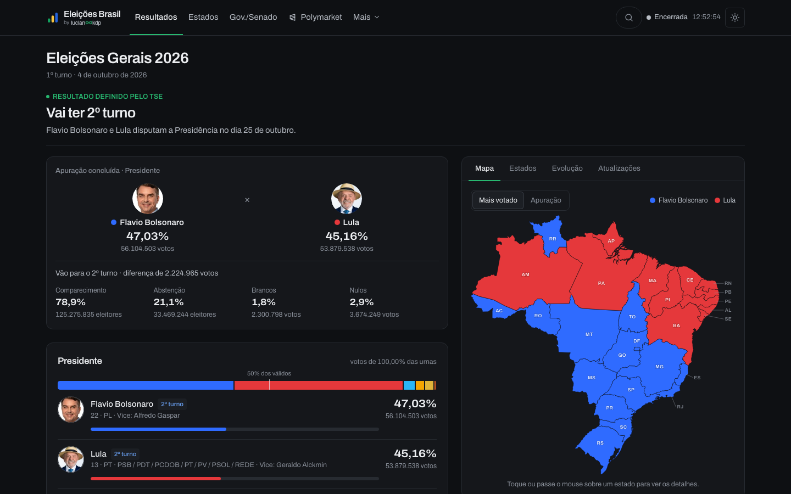
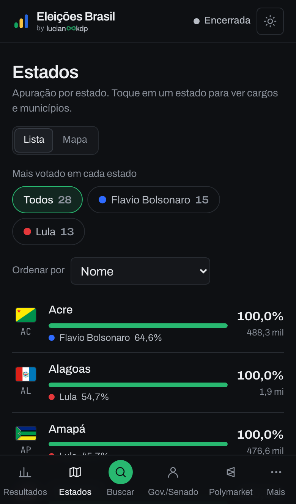
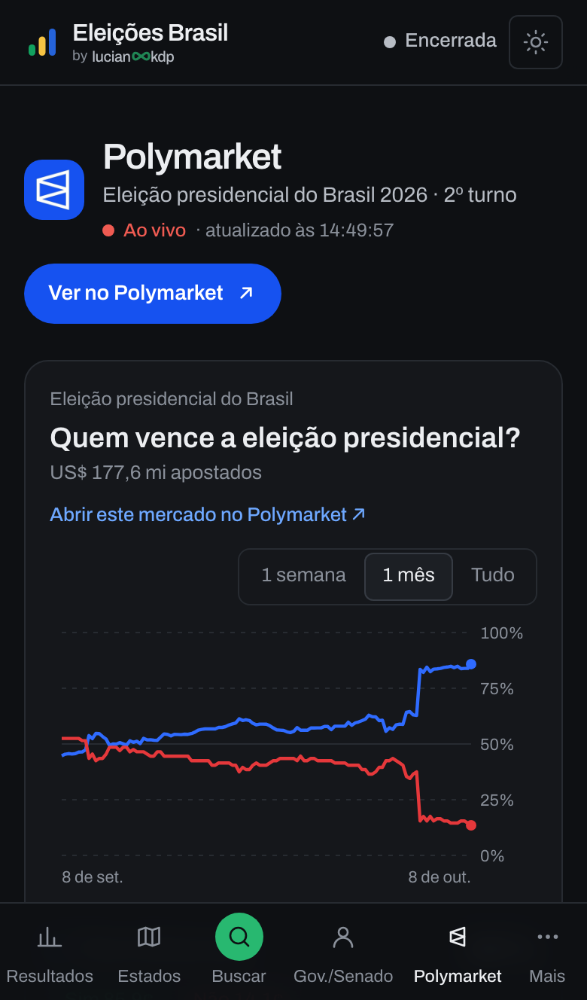
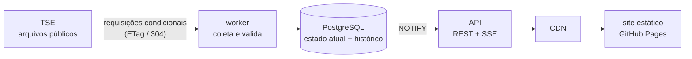

# Eleições Brasil

Apuração das eleições brasileiras em tempo real, com os dados oficiais do TSE. Rápido no
celular, neutro e sem previsões.

**Acesse: [eleicoes.lucianookdp.dev](https://eleicoes.lucianookdp.dev)**

[](https://github.com/lucianookdp/eleicoes-brasil/actions/workflows/ci.yml)
[](https://github.com/lucianookdp/eleicoes-brasil/actions/workflows/health.yml)
[](LICENSE)

<p>
  
</p>
<p>
  
  
  
</p>

## Funcionalidades

### Apuração ao vivo
- **Atualização automática:** cada nova parcial do TSE chega à tela em segundos, sem recarregar
  a página (Server-Sent Events). Um indicador mostra se está "Ao vivo", "Dados atrasados" ou
  "Encerrada".
- **Confronto principal:** os dois primeiros colocados lado a lado, com percentual, votos e
  diferença. O "Eleito" e o "Vai ter 2º turno" só aparecem quando o próprio TSE informa.
- **Quanto já foi apurado:** urnas apuradas no Brasil e por região, comparecimento, abstenção,
  brancos e nulos.
- **Mapa do Brasil:** cada estado pintado pelo mais votado ou pelo percentual apurado, com as
  siglas, e toque para ver os detalhes.
- **Evolução e liderança:** gráfico do percentual de cada candidato ao longo da noite e da
  vantagem do 1º sobre o 2º colocado.
- **Atualizações recentes:** o que acabou de mudar, por estado.
- **1º e 2º turno:** troca de turno em um toque, mantendo a página em que você está.

### Estados e municípios
- Resultados de **todos os cargos** em cada estado (Presidente, Governador, Senador, deputados)
  e em **cada município**, além dos votos no exterior.
- **Filtro por mais votado:** veja só os estados ou municípios onde cada candidato teve mais
  votos (ou está à frente, durante a apuração).
- Ordenação por nome, mais ou menos apurados, votos apurados ou atualizados agora.

### Governadores, Senado e STF
- Quem venceu ou foi para o 2º turno em cada estado, para governador e senador.
- **STF:** os ministros, quem indicou cada um, filtro por presidente, aposentadoria obrigatória,
  linha do tempo das posses, composição das duas turmas e o que o tribunal faz, com os artigos
  da Constituição.

### Bancadas
- **Câmara e Senado eleitos:** hemiciclo com as cadeiras de cada partido e quantos votos são
  necessários para cada tipo de decisão no Congresso.

### Ferramentas
- **Busca:** estados, municípios, candidatos, partidos e cargos em um só lugar.
- **Minha cidade:** escolha uma vez e veja a disputa da sua cidade no topo da página inicial.
- **Favoritos:** salve estados e cidades para acompanhar.
- **Comparar estados:** até oito estados lado a lado; a comparação fica no link para compartilhar.
- **Linha do tempo:** como estava a apuração em qualquer horário da noite.
- **Compartilhar:** imagem do resultado pronta para o WhatsApp e redes sociais.

### Mercado de apostas
- Página separada com os preços do **Polymarket** para o 2º turno: chance de cada candidato,
  gráfico histórico, margem de vitória e resultado por estado, atualizados a cada 30 segundos.
  Fica fora da apuração e não interfere nela: é o navegador de quem lê que consulta o Polymarket.

### Transparência
- **Bastidores:** o ritmo da apuração e o funcionamento da coleta, ao vivo.
- **Como funciona** e **Sobre os dados:** de onde vêm os números, como ler os horários e o que é
  calculado pelo site.
- Cada resultado mostra o horário de divulgação do TSE e o de recebimento aqui.

### Para todos
- Feito primeiro para o celular, de 320 px a telas grandes.
- Tema claro e escuro, seguindo o sistema, com botão para trocar.
- Sem contas, anúncios ou rastreamento. Favoritos e preferências ficam só no seu navegador.

## Princípios

- **Só dados oficiais.** Todos os números da apuração vêm dos arquivos públicos do Tribunal
  Superior Eleitoral (TSE), sem alteração.
- **Neutro.** Sem opinião, análise partidária, pesquisa ou projeção na apuração.
- **Leve com o TSE.** Só o nosso sistema consulta o tribunal, dentro dos limites de acesso que
  ele define; os leitores leem a nossa cópia.
- **Projeto independente,** sem vínculo com a Justiça Eleitoral. Resultados parciais podem
  mudar até o fim da apuração.

## Como funciona



- O **worker** consulta o TSE em dois ritmos (Brasil e estados com mais frequência, municípios
  em segundo plano), baixa só o que mudou e valida cada arquivo antes de gravar. Dados
  impossíveis são sinalizados e nunca apagam o que já estava certo.
- O **PostgreSQL** guarda o estado atual e cada atualização, o que permite a linha do tempo.
- A **API** responde com cache em memória, comprimido uma vez por atualização, e avisa os
  navegadores por Server-Sent Events. Na frente dela, uma CDN absorve os picos de acesso.
- O **site** é estático (Next.js exportado) e funciona mesmo se a API cair: mostra os últimos
  dados recebidos e avisa.

Mais detalhes em [docs/architecture.md](docs/architecture.md) e
[docs/tse-integration.md](docs/tse-integration.md).

## Tecnologias

| Parte | Tecnologias |
| --- | --- |
| Site | Next.js 16 (exportação estática), React, TanStack Query, Tailwind CSS |
| API | Fastify, Server-Sent Events, Zod |
| Coleta | Node.js, cliente HTTP com limite de taxa e requisições condicionais |
| Banco | PostgreSQL, Drizzle |
| Qualidade | TypeScript, Biome, Vitest, Playwright (fluxos e larguras de 320 a 1440 px, nos dois temas) |
| Infra | GitHub Pages, Railway (API, worker e Postgres), CDN, GitHub Actions |

## Rodar localmente

Requer Node.js 22+ e pnpm.

```bash
pnpm install
docker compose up -d postgres
pnpm dev:demo
```

Abre em http://localhost:3000 com uma eleição fictícia que é apurada em poucos minutos, para
ver tudo funcionando sem depender do TSE. Sem Docker, veja a seção "Postgres local sem Docker"
em [docs/deployment.md](docs/deployment.md).

```bash
pnpm lint        # Biome
pnpm typecheck   # TypeScript em todos os pacotes
pnpm test        # testes unitários e de integração (precisam do Postgres)
pnpm --filter @eleicoes/web test:e2e   # Playwright, com o modo demo rodando
```

## Estrutura

```
apps/
  web/       site (Next.js)
  api/       API pública (Fastify)
  worker/    coleta do TSE
packages/
  tse-client/       leitura e validação dos arquivos do TSE
  election-core/    tipos e regras compartilhadas
  database/         esquema e migrações (Drizzle)
  config/           variáveis de ambiente e versões
docs/        arquitetura, integração com o TSE, deploy, nova eleição
```

- [Deploy e noite da eleição](docs/deployment.md)
- [Como preparar uma nova eleição](docs/adding-new-election.md)

## Créditos

- Dados: Tribunal Superior Eleitoral (TSE).
- Mapa: "Map of Brazil", de Victor Cazanave ([svg-maps](https://github.com/VictorCazanave/svg-maps)), CC BY 4.0.
- Bandeiras dos estados: símbolos oficiais (domínio público), via Wikimedia Commons.
- Fotos dos ministros do STF: Wikimedia Commons (autores e licenças na própria página).
- Mercado de apostas: dados públicos do [Polymarket](https://polymarket.com).

## Licença

[MIT](LICENSE) · Feito por [lucianookdp](https://lucianookdp.dev)
